# Highway DSL

[](https://badge.fury.io/py/highway-dsl)
[](https://opensource.org/licenses/MIT)
[](https://pypi.org/project/highway-dsl/)
[](https://github.com/rodmena-limited/highway_dsl)
[](https://github.com/rodmena-limited/highway_dsl/actions/workflows/publish.yml)

**Highway DSL** is a Python-based domain-specific language for defining production-grade workflows with Temporal-style coordination patterns. It is part of the larger **Highway** project, an advanced workflow engine capable of running complex DAG-based workflows with durability guarantees.

> **🎯 LTS Stable Release**: Version 2.0.0 is a Long-Term Support release. No breaking changes will be introduced in the 2.x series, making it safe for production deployments. All future 2.x releases will maintain backward compatibility.

## Version 2.0.0 - LTS Stable Release

This is a **Long-Term Support (LTS)** release consolidating all features from the 1.x series into a stable, production-ready API:

### New Features & Fixes

#### 1. **JoinOperator for Explicit Coordination** (Temporal-Style)
Replaces brittle TriggerRule-based joins with explicit coordination semantics:
```python
from highway_dsl import WorkflowBuilder, JoinMode

builder = WorkflowBuilder("data_pipeline")
builder.task("start", "setup.init")

# Create parallel branches
builder.task("branch_a", "process.a", dependencies=["start"])
builder.task("branch_b", "process.b", dependencies=["start"])
builder.task("branch_c", "process.c", dependencies=["start"])

# Explicit join - wait for all branches to succeed
builder.join(
    task_id="sync_gate",
    join_tasks=["branch_a", "branch_b", "branch_c"],
    join_mode=JoinMode.ALL_SUCCESS,  # Fail fast if any branch fails
    description="Wait for all extractions"
)

builder.task("finalize", "process.merge", dependencies=["sync_gate"])
```

**Join Modes:**
- `JoinMode.ALL_OF` - Wait for all tasks to finish (any final state)
- `JoinMode.ANY_OF` - Complete when first task finishes (race condition)
- `JoinMode.ALL_SUCCESS` - Wait for all tasks to succeed (fail fast)
- `JoinMode.ONE_SUCCESS` - Complete when one task succeeds (fallback pattern)

#### 2. **Universal Result Storage**
All operators can now store results in workflow context (not just TaskOperator):
```python
# Now works for all operator types
builder.wait("sleep_5s", wait_for=Duration.seconds(5), result_key="sleep_result")
builder.emit_event("notify", event_name="done", result_key="emit_result")
builder.wait_for_event("wait", event_name="start", result_key="event_data")
```

#### 2. **Callback Validation**
Prevents runtime errors from typos in callback references:
```python
builder.task("main", "func").on_success("handler_task")
workflow = builder.build()  # Now validates "handler_task" exists!
```

#### 3. **Duration Helper Class**
Simplified time duration creation without datetime imports:
```python
from highway_dsl import Duration

builder.wait("pause", wait_for=Duration.minutes(30))
builder.retry(delay=Duration.seconds(5))
builder.timeout(timeout=Duration.hours(1))
```

#### 4. **Workflow Metadata**
Set workflow description and version programmatically:
```python
builder = WorkflowBuilder("my_workflow", version="2.0.0")
builder.set_description("Production ETL pipeline")
builder.set_version("2.1.0")  # Update version later
```

### Breaking Changes
- Default workflow version changed from "1.1.0" to "1.3.0"
- WaitOperator now serializes durations as ISO 8601 format (`PT<seconds>S`) instead of `duration:<seconds>`

---

## Version 1.1.0 - Feature Release

This major feature release adds **Airflow-parity** features to enable production-grade workflows:

### New Features

#### 1. **Scheduling Metadata** (Airflow Parity)
Define cron-based schedules directly in your workflow:
```python
builder = (
    WorkflowBuilder("daily_pipeline")
    .set_schedule("0 2 * * *")  # Run daily at 2 AM
    .set_start_date(datetime(2025, 1, 1))
    .set_catchup(False)
    .add_tags("production", "daily")
    .set_max_active_runs(1)
)
```

#### 2. **Event-Based Operators** (Absurd Integration)
First-class support for event-driven workflows:
```python
# Emit an event that other workflows can wait for
builder.emit_event(
    "notify_completion",
    event_name="pipeline_done",
    payload={"status": "success"}
)

# Wait for an external event
builder.wait_for_event(
    "wait_upstream",
    event_name="data_ready",
    timeout_seconds=3600
)
```

#### 3. **Callback Hooks** (Production Workflows)
Durable success/failure handlers as first-class workflow nodes:
```python
builder.task("risky_operation", "process.data")

builder.task("send_alert", "alerts.notify")
builder.on_failure("send_alert")  # Runs if risky_operation fails

builder.task("cleanup", "cleanup.resources")
builder.on_success("cleanup")  # Runs if risky_operation succeeds
```

#### 4. **Switch/Case Operator**
Multi-branch routing with cleaner syntax than nested conditions:
```python
builder.switch(
    "route_by_status",
    switch_on="{{data.status}}",
    cases={
        "approved": "approve_task",
        "rejected": "reject_task",
        "pending": "review_task"
    },
    default="unknown_handler"
)
```

#### 5. **Task Descriptions**
Document your workflow inline:
```python
builder.task(
    "process",
    "data.transform",
    description="Transform raw data into analytics format"
)
```

#### 6. **Workflow-Level Default Retry Policy**
Set a default retry policy for all tasks:
```python
builder.set_default_retry_policy(
    RetryPolicy(max_retries=3, delay=timedelta(seconds=60))
)
```

See `examples/scheduled_event_workflow.py` for a comprehensive example using all new features.

### RFC-Style Specification

For implementers and advanced users, Highway DSL v1.1.0 includes a comprehensive **3,215-line RFC-style specification** (`spec.txt`) modeled after IETF RFCs (RFC 2119, RFC 8259). This authoritative document provides:

- Complete operator specifications with execution semantics
- Integration guidance for Absurd and other runtimes
- Security considerations and best practices
- Comprehensive examples for all features
- Formal data model definitions

Access the specification at `/dsl/spec.txt` in the repository.

## Architecture Diagram

```mermaid
graph TB
    subgraph "Highway DSL v2.0.0 (LTS Stable)"
        A[WorkflowBuilder<br/>Fluent API] --> B[Core Operators]
        A --> C[Scheduling]
        A --> D[Events]
        A --> E[Error Handling]

        B --> B1[Task]
        B --> B2[Condition]
        B --> B3[Parallel]
        B --> B4[ForEach]
        B --> B5[While]
        B --> B6[Wait]
        B --> B7[Switch]
        B --> B8[Join]

        C --> C1[Cron Schedules]
        C --> C2[Start Date]
        C --> C3[Catchup]
        C --> C4[Tags]

        D --> D1[EmitEvent]
        D --> D2[WaitForEvent]

        E --> E1[RetryPolicy]
        E --> E2[TimeoutPolicy]
        E --> E3[Callbacks]
    end

    subgraph "Output Formats"
        F[YAML]
        G[JSON]
    end

    subgraph "Runtime Integration"
        H[Absurd Runtime]
        I[Airflow]
        J[Temporal]
        K[Custom Engines]
    end

    A --> F
    A --> G
    F --> H
    F --> I
    F --> J
    F --> K
    G --> H
    G --> I
    G --> J
    G --> K

    style A fill:#2563eb,stroke:#1e40af,color:#fff
    style B fill:#8b5cf6,stroke:#7c3aed,color:#fff
    style C fill:#10b981,stroke:#059669,color:#fff
    style D fill:#f59e0b,stroke:#d97706,color:#fff
    style E fill:#ef4444,stroke:#dc2626,color:#fff
```



## Features

*   **Fluent API:** A powerful and intuitive `WorkflowBuilder` for defining workflows programmatically.
*   **Pydantic-based:** All models are built on Pydantic, providing robust data validation, serialization, and documentation.
*   **Rich Operators:** A comprehensive set of operators for handling various workflow scenarios:
    *   `Task` - Basic workflow steps
    *   `Condition` (if/else) - Conditional branching
    *   `Parallel` - Execute multiple branches simultaneously
    *   `ForEach` - Iterate over collections with proper dependency management
    *   `Wait` - Pause execution for scheduled tasks
    *   `While` - Execute loops based on conditions
    *   **NEW in v1.1:** `EmitEvent` - Emit events for cross-workflow coordination
    *   **NEW in v1.1:** `WaitForEvent` - Wait for external events with timeout
    *   **NEW in v1.1:** `Switch` - Multi-branch routing (switch/case)
    *   **NEW in v1.3:** `Join` - Temporal-style explicit coordination with join modes (ALL_OF, ANY_OF, ALL_SUCCESS, ONE_SUCCESS)
*   **Scheduling:** Built-in support for cron-based scheduling, start dates, and catchup configuration
*   **Event-Driven:** First-class support for event emission and waiting (Absurd integration)
*   **Callback Hooks:** Durable success/failure handlers as workflow nodes
*   **YAML/JSON Interoperability:** Workflows can be defined in Python and exported to YAML or JSON, and vice-versa.
*   **Retry and Timeout Policies:** Built-in error handling and execution time management.
*   **Extensible:** The DSL is designed to be extensible with custom operators and policies.

## Installation

```bash
pip install highway-dsl
```

## Quick Start

Here's a simple example of how to define a workflow using the `WorkflowBuilder`:

```python
from datetime import timedelta
from highway_dsl import WorkflowBuilder

workflow = (
    WorkflowBuilder("simple_etl")
    .task("extract", "etl.extract_data", result_key="raw_data")
    .task(
        "transform",
        "etl.transform_data",
        args=["{{raw_data}}"],
        result_key="transformed_data",
    )
    .retry(max_retries=3, delay=timedelta(seconds=10))
    .task("load", "etl.load_data", args=["{{transformed_data}}"])
    .timeout(timeout=timedelta(minutes=30))
    .wait("wait_next", timedelta(hours=24))
    .task("cleanup", "etl.cleanup")
    .build()
)

print(workflow.to_yaml())
```

## Real-World Example: E-Commerce Order Processing

```python
from highway_dsl import WorkflowBuilder, RetryPolicy
from datetime import datetime, timedelta

# Production-ready e-commerce order workflow
workflow = (
    WorkflowBuilder("order_processing")
    .set_schedule("*/5 * * * *")  # Run every 5 minutes
    .set_start_date(datetime(2025, 1, 1))
    .add_tags("production", "orders", "critical")
    .set_default_retry_policy(RetryPolicy(max_retries=3, delay=timedelta(seconds=30)))

    # Fetch pending orders
    .task("fetch_orders", "orders.get_pending", result_key="orders")

    # Process each order
    .foreach(
        "process_each_order",
        items="{{orders}}",
        loop_body=lambda b: (
            b.task("validate", "orders.validate", args=["{{item}}"])
            .task("charge_payment", "payments.charge", args=["{{item}}"],
                  result_key="payment_result")
            .task("send_failure_email", "email.send_failure",
                  args=["{{item.customer_email}}"])
            .on_failure("send_failure_email")  # Alert on payment failure
            .switch(
                "route_by_amount",
                switch_on="{{item.total}}",
                cases={
                    "high": "priority_shipping",  # > $500
                    "medium": "standard_shipping",  # $100-500
                    "low": "economy_shipping"  # < $100
                },
                default="standard_shipping"
            )
        )
    )

    # Emit completion event for analytics workflow
    .emit_event(
        "notify_analytics",
        event_name="orders_processed_{{ds}}",
        payload={"count": "{{orders.length}}", "timestamp": "{{run.started_at}}"}
    )

    .build()
)
```

This workflow demonstrates:
- Scheduled execution every 5 minutes
- Default retry policy for all tasks
- ForEach loop processing multiple orders
- Payment failure callbacks
- Switch/case routing based on order amount
- Event emission for cross-workflow coordination

## Mermaid Diagram Generation

You can generate a Mermaid state diagram of your workflow using the `to_mermaid` method:

```python
print(workflow.to_mermaid())
```

This will output a Mermaid diagram in the `stateDiagram-v2` format, which can be used with a variety of tools to visualize your workflow.

## Bank ETL Example

A more complex example of a bank's end-of-day ETL process can be found in `examples/bank_end_of_the_day_etl_workflow.py`.

A mermaid diagram of this workflow can be found [here](docs/bank_etl.mermaid).

## Advanced Usage

### Conditional Logic

```python
from highway_dsl import WorkflowBuilder, RetryPolicy
from datetime import timedelta

builder = WorkflowBuilder("data_processing_pipeline")

builder.task("start", "workflows.tasks.initialize", result_key="init_data")
builder.task(
    "validate",
    "workflows.tasks.validate_data",
    args=["{{init_data}}"],
    result_key="validated_data",
)

builder.condition(
    "check_quality",
    condition="{{validated_data.quality_score}} > 0.8",
    if_true=lambda b: b.task(
        "high_quality_processing",
        "workflows.tasks.advanced_processing",
        args=["{{validated_data}}"],
        retry_policy=RetryPolicy(max_retries=5, delay=timedelta(seconds=10), backoff_factor=2.0),
    ),
    if_false=lambda b: b.task(
        "standard_processing",
        "workflows.tasks.basic_processing",
        args=["{{validated_data}}"],
    ),
)

workflow = builder.build()
```

### While Loops

```python
from highway_dsl import WorkflowBuilder

builder = WorkflowBuilder("qa_rework_workflow")

builder.task("start_qa", "workflows.tasks.start_qa", result_key="qa_results")

builder.while_loop(
    "qa_rework_loop",
    condition="{{qa_results.status}} == 'failed'",
    loop_body=lambda b: b.task("perform_rework", "workflows.tasks.perform_rework").task(
        "re_run_qa", "workflows.tasks.run_qa", result_key="qa_results"
    ),
)

builder.task("finalize_product", "workflows.tasks.finalize_product", dependencies=["qa_rework_loop"])

workflow = builder.build()
```

### For-Each Loops with Proper Dependency Management

Fixed bug where foreach loops were incorrectly inheriting dependencies from containing parallel operators:

```python
# This loop now properly encapsulates its internal tasks
builder.foreach(
    "process_items",
    items="{{data.items}}",
    loop_body=lambda fb: fb.task("process_item", "processor.handle_item", args=["{{item.id}}"])
    # Loop body tasks only have proper dependencies, not unwanted "grandparent" dependencies
)
```

### Retry Policies

```python
from highway_dsl import RetryPolicy
from datetime import timedelta

builder.task(
    "reliable_task",
    "service.operation",
    retry_policy=RetryPolicy(
        max_retries=5,
        delay=timedelta(seconds=10),
        backoff_factor=2.0
    )
)
```

### Timeout Policies

```python
from highway_dsl import TimeoutPolicy
from datetime import timedelta

builder.task(
    "timed_task",
    "service.operation",
    timeout_policy=TimeoutPolicy(
        timeout=timedelta(hours=1),
        kill_on_timeout=True
    )
)
```

## Version History

### Version 2.0.0 - LTS Stable Release (Current)

**🎯 Long-Term Support Release:**
- **Stable production API** - No breaking changes in 2.x series
- **Recommended for all production deployments**
- **Backward compatibility guaranteed** for all 2.x releases

**Consolidated Features:**
- JoinOperator for Temporal-style explicit coordination (ALL_OF, ANY_OF, ALL_SUCCESS, ONE_SUCCESS)
- Event-driven patterns (EmitEvent, WaitForEvent)
- SwitchOperator for multi-branch routing
- Scheduling metadata (cron, start_date, catchup, tags)
- Universal result_key support for all operators
- Idempotency support across all operators
- Duration helper class for time durations
- Callback hooks (on_success, on_failure) with validation
- Workflow metadata setters (description, version)

**Developer Experience:**
- Comprehensive RFC-style specification (3,500+ lines)
- Full Pydantic validation and type safety
- Clean fluent API for workflow construction

### Version 1.1.0 - Feature Release

**Airflow-Parity Features:**
- Scheduling metadata (cron, start_date, catchup, tags, max_active_runs)
- Workflow-level default retry policy

**Event-Driven Features:**
- EmitEventOperator for cross-workflow coordination
- WaitForEventOperator with timeout support

**Production Features:**
- Durable callback hooks (on_success, on_failure)
- SwitchOperator for multi-branch routing
- Task descriptions for documentation
- RFC-style specification document (3,215 lines)

### Version 1.0.3 - Stable Release

This is a stable release with important bug fixes and enhancements, including a critical fix for the ForEach operator dependency management issue.

## Development

To set up the development environment:

```bash
git clone https://github.com/your-username/highway.git
cd highway/dsl
python -m venv .venv
source .venv/bin/activate
pip install -e .[dev]
```

### Running Tests

```bash
pytest
```

### Type Checking

```bash
mypy .
```

## Documentation

- **README.md** (this file) - Getting started and examples
- **spec.txt** - RFC-style formal specification (3,215 lines)
- **examples/** - Comprehensive workflow examples

## License

MIT License
