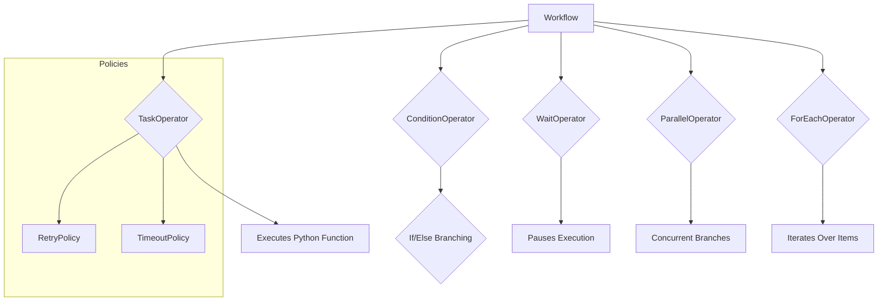

# Highway DSL

Highway DSL is a Python-based Domain Specific Language (DSL) for defining and managing complex workflows. It allows users to declaratively specify tasks, dependencies, and execution parameters, supporting various control flow mechanisms like conditions, parallel execution, and retries.

## Features

*   **Declarative Workflow Definition:** Define workflows using a clear and concise Python API or through YAML/JSON configurations.
*   **Pydantic Models:** Leverages Pydantic for robust data validation and serialization/deserialization of workflow definitions.
*   **Rich Task Types:** Supports various operators including:
    *   `TaskOperator`: Executes a Python function.
    *   `ConditionOperator`: Enables conditional branching based on expressions.
    *   `WaitOperator`: Pauses workflow execution for a specified duration or until a specific datetime.
    *   `ParallelOperator`: Executes multiple branches of tasks concurrently.
    *   `ForEachOperator`: Iterates over a collection, executing a chain of tasks for each item.
*   **Retry and Timeout Policies:** Define retry strategies and timeout limits for individual tasks.
*   **Serialization/Deserialization:** Seamless conversion of workflow definitions between Python objects, YAML, and JSON formats.
*   **Workflow Builder:** A fluent API for constructing workflows programmatically.

### Feature Overview



## Installation

To install Highway DSL, you can use pip:

```bash
pip install highway-dsl
```

If you want to install it for development, including testing dependencies:

```bash
pip install "highway-dsl[dev]"
```

## Usage

### Defining a Simple Workflow

```python
from datetime import timedelta
from highway_dsl import WorkflowBuilder

def demonstrate_basic_workflow():
    """Show a simple complete workflow using just the builder"""

    workflow = (
        WorkflowBuilder("simple_etl")
        .task("extract", "etl.extract_data", result_key="raw_data")
        .task(
            "transform",
            "etl.transform_data",
            args=["{{raw_data}}"],
            result_key="transformed_data",
        )
        .retry(max_retries=3, delay=timedelta(seconds=10))
        .task("load", "etl.load_data", args=["{{transformed_data}}"])
        .timeout(timeout=timedelta(minutes=30))
        .wait("wait_next", timedelta(hours=24))
        .task("cleanup", "etl.cleanup")
        .build()
    )

    workflow.set_variables(
        {"database_url": "postgresql://localhost/mydb", "chunk_size": 1000}
    )

    return workflow

if __name__ == "__main__":
    basic_workflow = demonstrate_basic_workflow()
    print(basic_workflow.to_yaml())
```

### Defining a Complex Workflow

Refer to `example_usage.py` for a more complex example demonstrating conditional logic, parallel execution, and iteration.

### YAML Configuration

You can also define workflows directly in YAML:

```yaml
name: simple_etl
version: 1.0.0
description: Simple ETL workflow with retry and timeout
variables:
  database_url: postgresql://localhost/mydb
  chunk_size: 1000
start_task: extract
tasks:
  extract:
    task_id: extract
    operator_type: task
    function: etl.extract_data
    result_key: raw_data
    dependencies: []
    metadata: {}
    
  transform:
    task_id: transform
    operator_type: task
    function: etl.transform_data
    args: ["{{raw_data}}"]
    result_key: transformed_data
    dependencies: ["extract"]
    retry_policy:
      max_retries: 3
      delay: PT10S
      backoff_factor: 2.0
    metadata: {}
    
  load:
    task_id: load
    operator_type: task
    function: etl.load_data
    args: ["{{transformed_data}}"]
    dependencies: ["transform"]
    timeout_policy:
      timeout: PT30M
      kill_on_timeout: true
    metadata: {}
    
  wait_next:
    task_id: wait_next
    operator_type: wait
    wait_for: "P1D"
    dependencies: ["load"]
    metadata: {}
    
  cleanup:
    task_id: cleanup
    operator_type: task
    function: etl.cleanup
    dependencies: ["wait_next"]
    metadata: {}
```

To load this YAML:

```python
from highway_dsl import Workflow

yaml_content = """
# ... (yaml content from above)
"""

workflow = Workflow.from_yaml(yaml_content)
print(workflow.name)
```

## Development

### Running Tests

To run the unit tests, navigate to the project root and execute:

```bash
pytest
```

### Type Checking

To perform static type checking with MyPy:

```bash
mypy .
```

## Project Structure

```
.highway/
├── highway_dsl/
│   ├── __init__.py         # Exposes the public API
│   └── workflow_dsl.py     # Core DSL definitions (Pydantic models)
├── example_usage.py        # Examples of how to use the DSL
├── tests/
│   ├── __init__.py
│   ├── conftest.py         # Pytest configuration
│   └── test_workflow_dsl.py # Unit and integration tests
├── pyproject.toml          # Project metadata and dependencies
├── README.md               # This file
└── SUMMARY.md              # Summary of changes and future instructions
```
